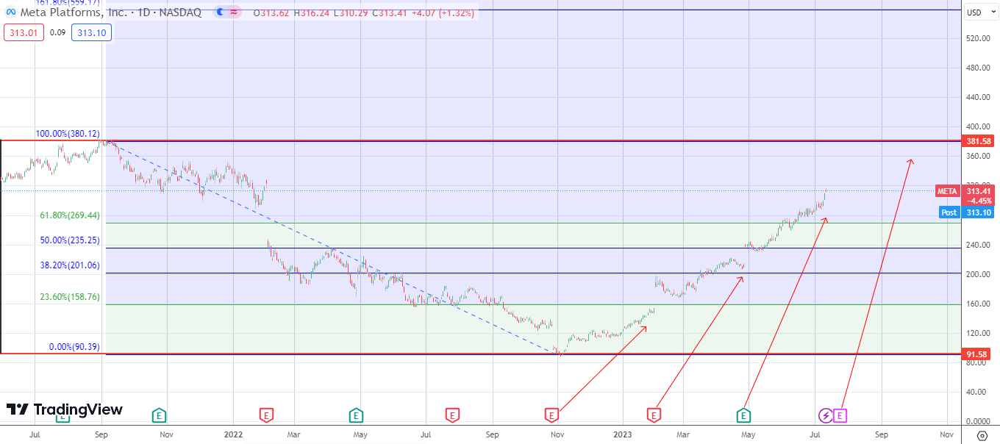

## Introduction

Welcome, friends! We're diving into the world of Meta Platforms, a tech titan that's shaking up the digital world. This powerhouse, based in California, has built popular platforms like Facebook, Instagram, Threads, and WhatsApp. Plus, Meta Platforms is not just about social media; they're also making strides in new areas through exciting acquisitions, and even venturing into the world of hardware!

Now, Meta is going one step further. They're rebranding and focusing on building a "metaverse", a virtual reality space where users can interact with each other and the environment. To get a handle on what this shift might mean for potential investors, I've done some analysis on META's stock prices. Let's dive into the details!

## Data Collection and Pre-processing

To get started, we need some data. I used a dataset containing Meta Platforms' (formerly Facebook) stock prices over the past three years.

```{r setup, include=FALSE}
knitr::opts_chunk$set(echo = TRUE)
# Loading required packages
library(readr)
library(tidyverse)
library(ggplot2)
library(quantmod)
library(zoo)
library(lubridate)
library(stringr)
library(janitor)
library(plotly)

# Reading in the data
meta_data <- read_csv("meta_historical_data.csv")

# Clean up the data
colnames(meta_data) <- tolower(colnames(meta_data))

meta_data_clean <- meta_data %>%
  mutate(date = lubridate::mdy(date),
         `change %` = as.numeric(str_remove(`change %`, "%"))) %>%
  janitor::clean_names()
```
Next, I added some extra information to the data, like which year, month, and day each data point belongs to, as well as which quarter. I also converted the 'vol' column to numeric.

```{r}
meta_data_clean <- meta_data_clean %>%
  mutate(year = lubridate::year(date),
         month = lubridate::month(date),
         day = lubridate::day(date),
         quarter = lubridate::quarter(date),
         vol = as.numeric(str_remove(vol, "M")) * 1e6)
```
## Exploratory Data Analysis
With the data all cleaned up, I started by making a "candlestick" chart. This type of chart is used a lot in financial analysis because it shows the opening, closing, high, and low prices for a stock, all in one neat package.
```{r}
# Prepare data for plotly
df_plotly <- meta_data_clean %>% 
  select(date, open, high, low, price) %>% 
  rename(Close = price)

# Create candlestick chart
fig <- df_plotly %>% plot_ly(x = ~date, type="candlestick",
                             open = ~open, close = ~Close,
                             high = ~high, low = ~low) 

# Add title and adjust axis labels
fig <- fig %>% layout(title = "Candlestick Chart - 06-2021/06-2023",
                      xaxis = list(rangeslider = list(visible = F)),
                      yaxis = list(title = "Price"))

fig
```
From this chart, I could identify certain patterns and trends in the stock prices over time. Additionally, I added support and resistance lines to the chart. These lines are crucial in understanding market trends and predicting potential breakouts or breakdowns.
```{r}
# Create candlestick chart
fig2 <- df_plotly %>% plot_ly(x = ~date, type="candlestick",
                             open = ~open, close = ~Close,
                             high = ~high, low = ~low) 

# Add title and adjust axis labels
fig2 <- fig2 %>% layout(title = "Candlestick Chart with Support and Resistance",
                      xaxis = list(rangeslider = list(visible = F)),
                      yaxis = list(title = "Price"))

# Add support and resistance lines
support_line <- min(df_plotly$low)
resistance_line <- max(df_plotly$high)

# Create list of shapes for layout
shapes <- list(
  list(
    type = "line", 
    x0 = min(df_plotly$date), 
    x1 = max(df_plotly$date),
    y0 = support_line, 
    y1 = support_line, 
    line = list(color = "blue")
  ),
  list(
    type = "line", 
    x0 = min(df_plotly$date), 
    x1 = max(df_plotly$date),
    y0 = resistance_line, 
    y1 = resistance_line, 
    line = list(color = "red")
  )
)

# Add shapes to the layout
fig2 <- fig2 %>% layout(shapes = shapes)

fig2
```
## TradingView Chart

To confirm my findings, I did an analysis using the platform TradingView. I added strong Support and Resistance lines on the chart and drew a Fibonacci Retracement between them. I also included some arrows to show how the price moved after the last few Earnings. The image below displays my findings...
```{r}

```
## Conlusion
Fasten your seatbelts, META investors! After a turbulent period of dropping stock prices, the tech giant has shown a promising bounce back. Positive earnings reports and the launch of exciting new products – such as VR glasses, the Threads platform, and advanced AI programs – have reignited investor confidence, pushing the stock price into the 300s.

However, those considering investing in META might want to pause for a moment. The stock is currently floating near its highest ever price, making it a less attractive purchase for those looking for a bargain. As the old saying goes, 'buy low, sell high', and right now, we're closer to the high end.

For those already aboard the META train, it could be a good time to consider pocketing some profits. The Fibonacci Retracement analysis shows the stock price creeping closer to the 100% retracement level, a significant marker that could signal a potential price turnaround. But don't rush to the exit just yet - other indicators need to be considered before making any quick decisions. If earnings follow the expected path, we could see the stock price continuing its climb, potentially reaching the 161% retracement level by August or September.

Before you start dreaming about all the money you might make, remember: the stock market can be like a wild roller coaster ride. It can go up and down very quickly. The META stock price is nearing a very important point, and that could be a sign that says 'Watch Out! The price might start dropping soon.' But don't worry too much right away! We have to look at other signs and see if the company will make more money than we thought. If things go well, the stock price might soar even higher by August and September of 2023.
My aspiration with this analysis is to provide you with insights into the performance of the META stock market. It is my hope that the data presented can equip you with the necessary knowledge to enhance your investment decision-making process.

## References

The primary data for this analysis was sourced from Investing.com, a well-known and credible financial market platform that provides real-time data, quotes, charts, financial tools, and the most recent news pertaining to markets around the globe.

- Investing.com. (2023). Meta Platforms Inc (META) Historical Data. Retrieved from [https://www.investing.com/equities/facebook-inc-historical-data](https://www.investing.com/equities/facebook-inc-historical-data)

Secondary data, particularly the background information of Meta Platforms Inc., was obtained from Wikipedia, a free online encyclopedia created and edited by volunteers worldwide.

- Wikipedia. (2023). Meta Platforms. Retrieved from [https://en.wikipedia.org/wiki/Meta_Platforms](https://en.wikipedia.org/wiki/Meta_Platforms)

The data analysis and visualization in this report utilized several R packages: `readr`, `tidyverse`, `ggplot2`, `quantmod`, `zoo`, `lubridate`, `stringr`, `janitor`, and `plotly`. For in-depth understanding and applications of these packages, please refer to their respective documentation and online resources:

- `quantmod`: [online tutorial](http://www.quantmod.com/examples/intro/)
- `zoo`: [official documentation](https://cran.r-project.org/web/packages/zoo/zoo.pdf) and [tutorial](https://www.statmethods.net/advstats/timeseries.html)
- `plotly`: [official documentation](https://plotly.com/r/) 

Kindly note that all the data used in this project is for educational purposes and the analysis does not constitute investment advice.
